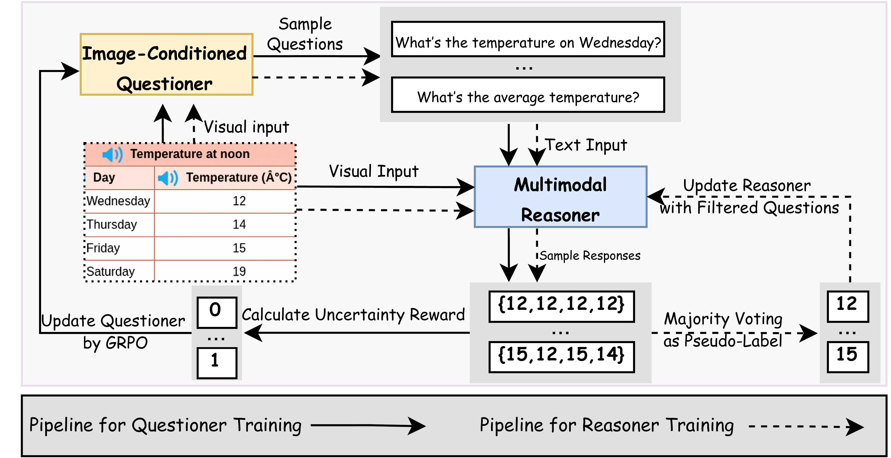

## VisPlay: Self-Evolving Vision-Language Models

Reinforcement learning (RL) provides a principled framework for improving vision-language models (VLMs) on complex reasoning tasks. However, existing RL approaches often depend on human-annotated labels or task-specific heuristics to define verifiable rewards—both costly and limited in scalability. We introduce VisPlay, a self-evolving RL framework that enables VLMs to autonomously improve their reasoning capabilities from massive unlabeled image data. Starting from a single base VLM, VisPlay assigns the model into two interacting roles: an Image-Conditioned Questioner that formulates challenging yet answerable visual questions, and a Multimodal Reasoner that generates silver responses. These roles are jointly trained using Group Relative Policy Optimization (GRPO), which uses diversity and difficulty rewards to balance the difficulty of generated questions with the quality of silver answers. VisPlay scales efficiently across two model families. Trained on Qwen2.5-VL and MiMo-VL, VisPlay achieves consistent improvements in visual reasoning, compositional generalization, and hallucination reduction across eight benchmarks including MM-Vet and MMMU, and establishes a scalable path toward self-evolving multimodal intelligence.

[](https://bruno686.github.io/VisPlay/)


<p align="center">
    
</p>


## Requirements

The code base adopted from [R-Zero](https://github.com/Chengsong-Huang/R-Zero/tree/main) and [Vision-SR1](https://github.com/zli12321/Vision-SR1).

### Software Requirements

- Python 3.9+
- transformers=4.49.0

### Self-Evolving Setup
```
git clone https://github.com/bruno686/VisPlay.git
cd VisPlay
conda create -n VisPlay python=3.11
bash setup.sh

# Set an environment variable for your storage path in every main script.
# This is a large directory where checkpoints and generated data will be saved.
export STORAGE_PATH="/path/to/your/storage"
export HUGGINGFACENAME="yourhuggingfacename"

mkdir -p \
  "$STORAGE_PATH/evaluation" \
  "$STORAGE_PATH/models" \
  "$STORAGE_PATH/generated_question" \
  "$STORAGE_PATH/temp_results"
```

### Self-Play Training Scripts
```
bash scripts_Qwen-VL-3B/main.sh
bash scripts_Qwen-VL-7B/main.sh
bash scripts_MIMO-VL-7B/main.sh
```


### Evaluation & LLM-as-a-Judge Evaluation
We use ChatGLM-flash as the Judge. Different LLM judges will result in different evaluation results. For reference, we also comput the rule-based evaluation accuracies, which is lower than LLM-as-Judges on Math datasets.

1. ##### Generate responses from trained LLM
We provide all the historic LLM generations for a quick reference and access to the results
```
bash validation_examples/eval_gen_questions.sh $experiment_name $your_model_path
```
For example:
```
bash validation_examples/eval_gen_questions.sh MIMO-VL-7B-solver_v3 /your_path/vr-zero/storage/models/MiMo-VL-7B-SFT_solver_v3/global_step_10/actor/huggingface
```


2. ##### Use LLM-as-a-judge to generate result
```
bash Evaluation/eval.sh
```

## Citation

If you find our works helpful, please cite

```bibtex
@misc{VisPlay,
      title={VisPlay: Self-Evolving Vision-Language Models}, 
      author={Yicheng He, Chengsong Huang, Zongxia Li, Jiaxin Huang, Yonghui Yang},
      year={2025},
      eprint={251118.19652},
      archivePrefix={arXiv},
      primaryClass={cs.CV},
      url={https://arxiv.org/abs/2508.19652}, 
}
```

Our framework is directly based on the great work of Vision-SR1 and R-Zero. So,we recommend to also cite the sourcecode work.

```bibtex
@misc{li2025selfrewardingvisionlanguagemodelreasoning,
      title={Self-Rewarding Vision-Language Model via Reasoning Decomposition}, 
      author={Zongxia Li and Wenhao Yu and Chengsong Huang and Rui Liu and Zhenwen Liang and Fuxiao Liu and Jingxi Che and Dian Yu and Jordan Boyd-Graber and Haitao Mi and Dong Yu},
      year={2025},
      eprint={2508.19652},
      archivePrefix={arXiv},
      primaryClass={cs.CV},
      url={https://arxiv.org/abs/2508.19652}, 
}

@article{huang2025rzeroselfevolvingreasoningllm,
      title={R-Zero: Self-Evolving Reasoning LLM from Zero Data}, 
      author={Chengsong Huang and Wenhao Yu and Xiaoyang Wang and Hongming Zhang and Zongxia Li and Ruosen Li and Jiaxin Huang and Haitao Mi and Dong Yu},
      year={2025},
      eprint={2508.05004},
      archivePrefix={arXiv},
      primaryClass={cs.LG},
      url={https://arxiv.org/abs/2508.05004}, 
}
```
